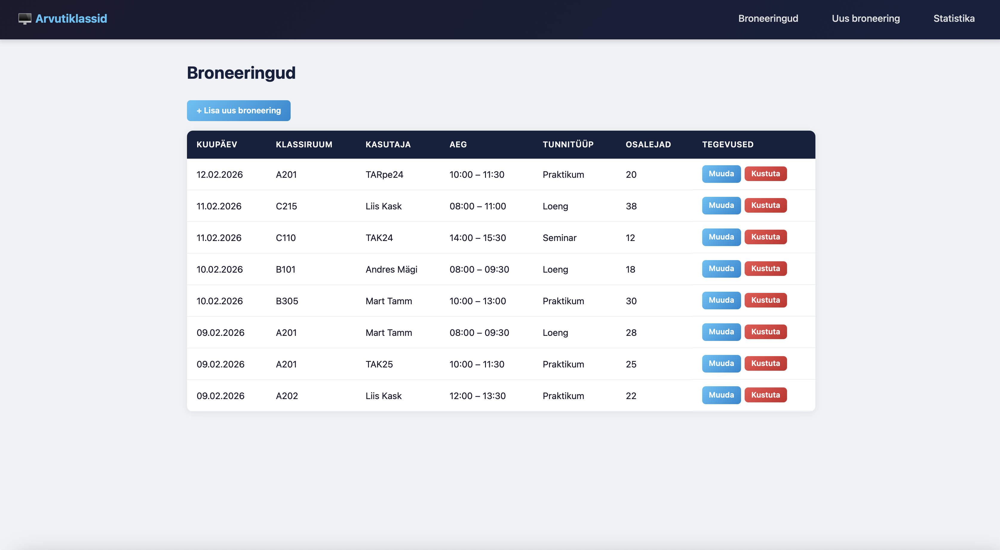
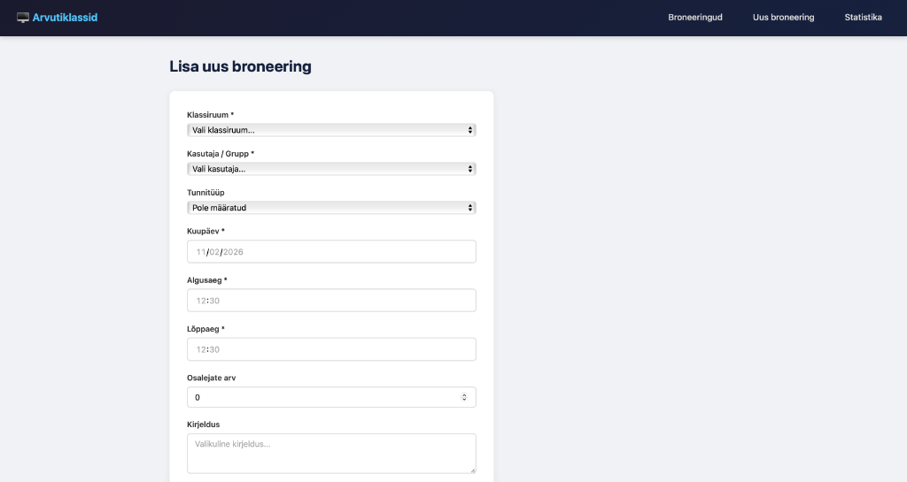
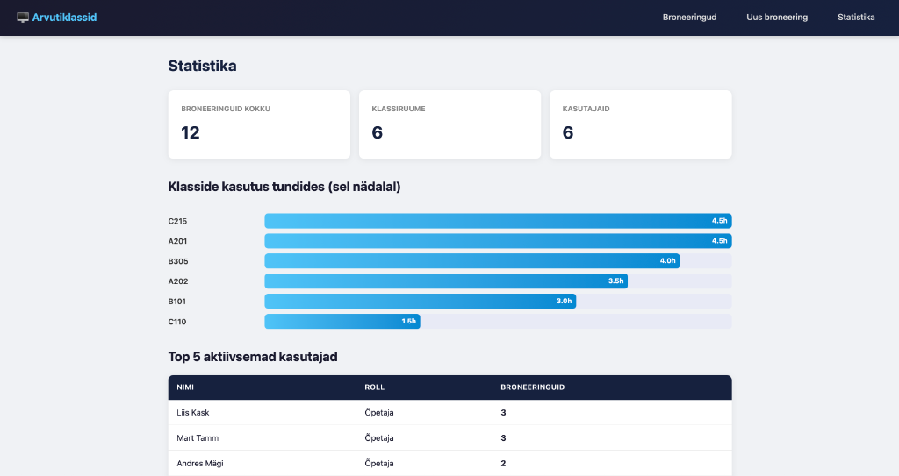
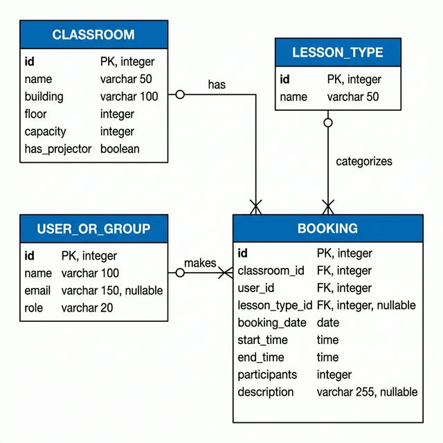
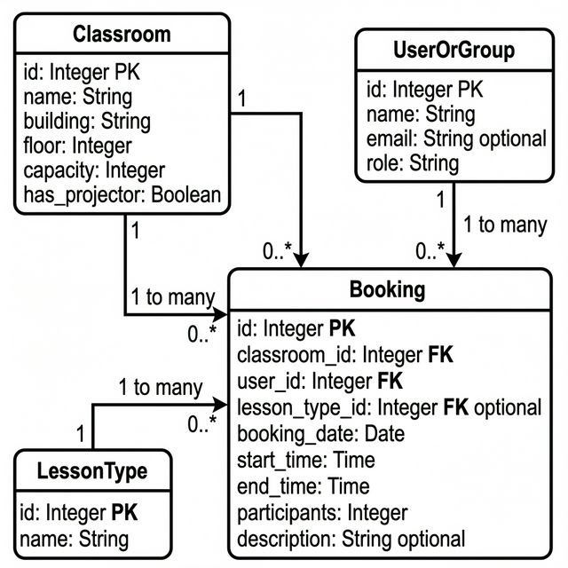

# Arvutiklasside kasutuse andmebaasirakendus

**Grupp:** TAK25
**Tehnoloogiad:** Bun + Hono + PostgreSQL (Docker)

## Eeldused

- [Bun](https://bun.sh/) (v1.0+)
- [Docker](https://www.docker.com/) ja Docker Compose

## Käivitamine

### 1. Andmebaasi käivitamine

```bash
docker compose up -d
```

See loob PostgreSQL 16 konteineri ja käivitab automaatselt `schema.sql` (tabelite loomine).

### 2. Sõltuvuste installimine

```bash
cd app
bun install
```

### 3. Näidisandmete sisestamine

**Variant A – seed skript (kiire):**
```bash
cd app
bun run seed
```

**Variant B – import erinevatest failidest (CSV/JSON/XML):**
```bash
bun run import/import.ts
```

### 4. Rakenduse käivitamine

```bash
cd app
bun run dev
```

Ava brauseris: **http://localhost:3000**

## Ekraanipildid

### Broneeringute loend


### Uue broneeringu lisamine


### Statistikavaade


## Diagrammid

### ERD (Crow's Foot)


### UML klassidiagramm


## Projekti struktuur

```
database_new/
├── schema.sql                  # DDL (CREATE TABLE)
├── erd_crowsfoot.png           # ERD diagramm (Crow's Foot)
├── uml_class.png               # UML klassidiagramm
├── logical_design.md           # Loogiline disain
├── docker-compose.yml          # PostgreSQL Docker
├── permissions.sql             # Rollid ja õigused
├── permissions.md              # Õiguste testimise kirjeldus
├── app/                        # Veebirakendus (Bun + Hono)
│   ├── package.json
│   ├── tsconfig.json
│   └── src/
│       ├── index.ts            # Server (port 3000)
│       ├── db.ts               # DB ühendus
│       ├── seed.ts             # Näidisandmed
│       ├── routes/
│       │   ├── bookings.ts     # CRUD marsruudid
│       │   └── statistics.ts   # Statistikavaade
│       └── views/
│           └── layout.ts       # HTML template
├── import/                     # Import failid
│   ├── classes.csv
│   ├── teachers.json
│   ├── bookings.xml
│   └── import.ts               # Impordiskript
├── export/                     # Eksporditud failid
│   └── export.ts               # Ekspordiskript
└── backup/                     # Varundamine
    └── backup_restore.md       # Juhend
```

## Funktsioonid

| Funktsioon | Kirjeldus |
|-----------|-----------|
| **Broneeringute loend** | Kõik broneeringud koos klassi, kasutaja ja kellaajaga |
| **Lisa broneering** | Vorm klassiriuumi, kasutaja, aja ja tüübi valikuga |
| **Muuda broneeringut** | Olemasoleva broneeringu andmete muutmine |
| **Kustuta broneering** | Broneeringu eemaldamine kinnitusega |
| **Statistika** | Klasside kasutus tundides (jooksev nädal), top kasutajad |

## Import/eksport

- **Import:** `bun run import/import.ts` — loeb CSV, JSON, XML ja sisestab andmebaasi
- **Eksport:** `bun run export/export.ts` — genereerib `export/bookings_summary.csv` ja `export/top5_classes.json`

## Õigused

```bash
# Käivita permissions.sql admin kasutajana:
docker exec -i classroom_db psql -U admin -p 5432 classroom_booking < permissions.sql
```

Vt lähemalt: [permissions.md](permissions.md)

## Varundamine

```bash
# Varukoopia:
docker exec classroom_db pg_dump -U admin classroom_booking > backup/backup_2026-02-11.sql

# Taastamine:
docker exec -i classroom_db psql -U admin classroom_booking < backup/backup_2026-02-11.sql
```

Vt lähemalt: [backup_restore.md](backup/backup_restore.md)
